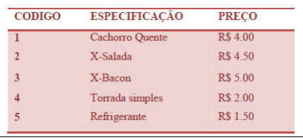
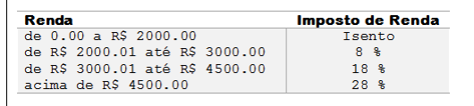

# Repositório de exercícios do curso de Java do professor Nelio Alves

### Exercício 01

Faça um programa para ler dois valores inteiros, e depois mostrar na tela a soma desses números com uma mensagem explicativa.

### Exercício 02

Faça um programa para ler o valor do raio de um círculo, e depois mostrar o valor da área deste círculo com quatro casas decimais.
Fórmula da área: area = π . raio2
Considere o valor de π = 3.14159

### Exercício 03

Fazer um programa para ler quatro valores inteiros A, B, C e D. A seguir, calcule e mostre a diferença do produto de A e B pelo produto de C e D segundo a fórmula: DIFERENCA = (A * B - C * D).

### Exercício 04

Fazer um programa que leia o número de um funcionário, seu número de horas trabalhadas, o valor que recebe por hora e calcula o salário desse funcionário. A seguir, mostre o número e o salário do funcionário, com duas casas decimais.

### Exercício 05

Fazer um programa para ler o código de uma peça 1, o número de peças 1, o valor unitário de cada peça 1, o
código de uma peça 2, o número de peças 2 e o valor unitário de cada peça 2. Calcule e mostre o valor a ser pago.

### Exercício 06

Fazer um programa que leia três valores com ponto flutuante de dupla precisão: A, B e C. Em seguida, calcule e mostre:
a) a área do triângulo retângulo que tem A por base e C por altura.
b) a área do círculo de raio C. (pi = 3.14159)
c) a área do trapézio que tem A e B por bases e C por altura.
d) a área do quadrado que tem lado B.
e) a área do retângulo que tem lados A e B.

## Exercícios sobre Estrutura Condicional

### Exercício 01

Fazer um programa para ler um número inteiro, e depois dizer se este número é negativo ou não.

### Exercício 02

Fazer um programa para ler um número inteiro e dizer se este número é par ou ímpar.

### Exercício 03

Leia 2 valores inteiros (A e B). Após, o programa deve mostrar uma mensagem "Sao Multiplos" ou "Nao sao
Multiplos", indicando se os valores lidos são múltiplos entre si. Atenção: os números devem poder ser digitados em
ordem crescente ou decrescente.

### Exercício 04

Leia a hora inicial e a hora final de um jogo. A seguir calcule a duração do jogo, sabendo que o mesmo pode
começar em um dia e terminar em outro, tendo uma duração mínima de 1 hora e máxima de 24 horas.

### Exercício 05

Com base na tabela abaixo, escreva um programa que leia o código de um item e a quantidade deste item. A
seguir, calcule e mostre o valor da conta a pagar.

Lembre que, se o salário for R$ 3002.00, a taxa que incide é de 8% apenas sobre R$ 1000.00, pois a faixa de
salário que fica de R$ 0.00 até R$ 2000.00 é isenta de Imposto de Renda. No exemplo fornecido (abaixo), a taxa é
de 8% sobre R$ 1000.00 + 18% sobre R$ 2.00, o que resulta em R$ 80.36 no total. O valor deve ser impresso com
duas casas decimais.

### Exercício 06

Você deve fazer um programa que leia um valor qualquer e apresente uma mensagem dizendo em qual dos
seguintes intervalos ([0,25], (25,50], (50,75], (75,100]) este valor se encontra. Obviamente se o valor não estiver em
nenhum destes intervalos, deverá ser impressa a mensagem “Fora de intervalo”.

### Exercício 07

Leia 2 valores com uma casa decimal (x e y), que devem representar as coordenadas
de um ponto em um plano. A seguir, determine qual o quadrante ao qual pertence o
ponto, ou se está sobre um dos eixos cartesianos ou na origem (x = y = 0).
Se o ponto estiver na origem, escreva a mensagem “Origem”.
Se o ponto estiver sobre um dos eixos escreva “Eixo X” ou “Eixo Y”, conforme for a
situação.

### Exercício 08

Em um país imaginário denominado Lisarb, todos os habitantes ficam felizes em pagar seus impostos, pois sabem
que nele não existem políticos corruptos e os recursos arrecadados são utilizados em benefício da população, sem
qualquer desvio. A moeda deste país é o Rombus, cujo símbolo é o R$.
Leia um valor com duas casas decimais, equivalente ao salário de uma pessoa de Lisarb. Em seguida, calcule e
mostre o valor que esta pessoa deve pagar de Imposto de Renda, segundo a tabela abaixo.

### Exercício 09

Programe uma função que receba um inteiro representando o tamanho de um arquivo, em Bytes, e retorne uma string com este tamanho formatado na maior escalo possível, sendo que este número não pode ser menor que 1.
Se o tamanho do arquivo for 1000, o resultado ccorreto seria '1000 B', invés de '0.97 KB'.
Utilize como padrão o número com duas casa decimais, espaço em branco, mais a escala escolhida. 